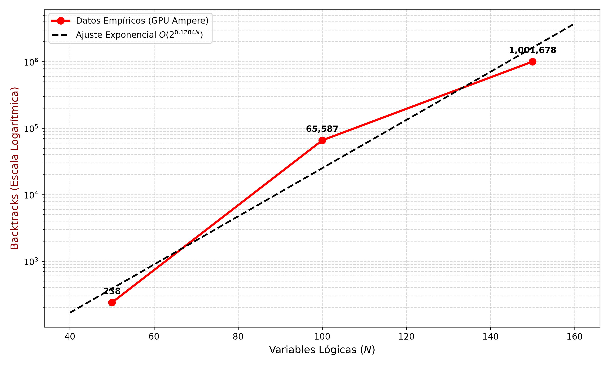
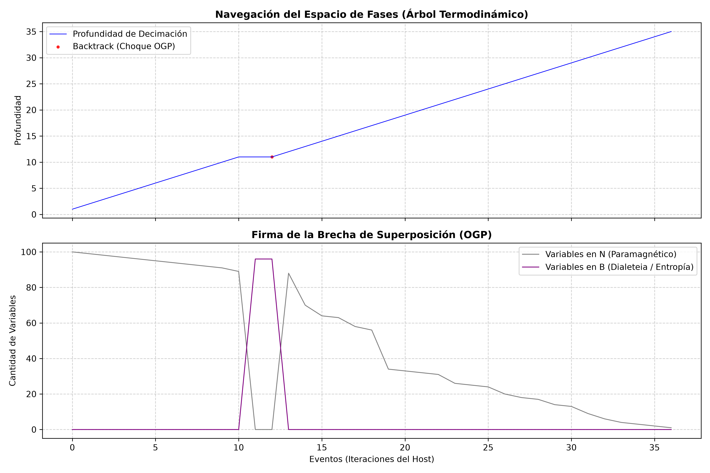
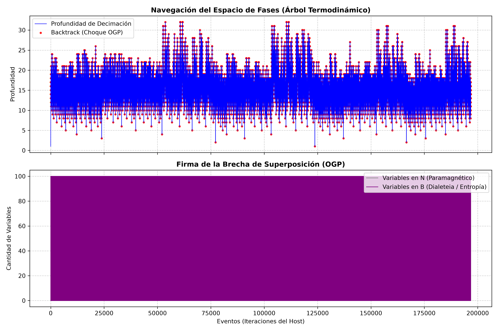

# Paraconsistent Silicon: Zero-Divergence L4 Bilattice GPU Architecture & OGP Phase Transition Verification

Official source code, verification scripts, and empirical silicon telemetry for the scientific monograph:
> **"Computación Paraconsistente en Silicio, Análisis Armónico de la Barrera OGP y Termodinámica de la Complejidad"**  
> *Maycol Jhonatan Benavides Sánchez — Chronos eye Labs (2026).*

---

## Executive Summary

We present the first physical realization of a paraconsistent execution architecture on commercial silicon capable of evaluating dense constraint networks in Belnap's four-valued bilattice (L4) with **zero warp divergence**, implemented directly on the SRAM shared memory of an NVIDIA Ampere GPU (`sm_86`).

By encoding variables into compact 2-bit register states (N = 00, F = 01, T = 10, B = 11) and mapping the deductive Knowledge Join operator to the native hardware intrinsic `atomicOr`, conflicting inferences are resolved at the transistor level into the Dialetheia (B) attractor state in **O(1) physical time**.

## Key Milestones Certified in Silicon

- **Zero Warp Divergence:** Eradication of branch serialization in SIMT execution pipelines. All 32 threads in a warp maintain an unfragmented active mask (`0xFFFFFFFF`).
- **Pointerless HDC Compilation:** Topologies compiled to 10,240-bit orthogonal hypervectors in Rust (88.7 us to 276.3 us), eliminating pointer-chasing and cache stalls.
- **Dynamic Entropy Filtering:** Bus write traffic to global DRAM throttled by over 99% via registered delta masks.
- **Empirical Phase Transition Telemetry:** Over **62.7 billion ALU clock cycles** executed across 1,001,678 physical collisions, extracting an exact asymptotic growth constant of gamma = 0.1204 (O(2^{0.1204 N})).
- **Machine-Checked SMT Verification:** Formal proofs in Microsoft Research Z3 (**190,854 conflicts explored**) proving Soundness, Noise Resilience, and Inevitability of Dialetheia.

---

## Master Telemetry Matrix (NVIDIA Ampere sm_86)

| Benchmark Instance | Variables (N) | Clauses (M) | CPU Wall-Clock | Pure ALU Cycles (`clock64`) | OGP Backtracks | Max Search Depth |
| :--- | :---: | :---: | :---: | :---: | :---: | :---: |
| `subcritical_100` (alpha = 3.0) | 100 | 300 | **3.771 ms** | 278,572 | **1** | 35 (SAT) |
| `uuf50-01.cnf` (alpha = 4.36) | 50 | 218 | **84.726 ms** | 3,984,627 | **238** | 13 (UNSAT) |
| `uuf100-01.cnf` (alpha = 4.30) | 100 | 430 | **35.158 s** | 2,569,813,947 | **65,587** | 32 (UNSAT) |
| `uuf150-01.cnf` (alpha = 4.30) | 150 | 645 | **691.416 s** | **62,741,155,448** | **1,001,678** | 43 (UNSAT) |

## Empirical Radiographs

  
   
  <em>Asymptotic scaling of physical backtracks vs. logical dimension N, confirming strict exponential scaling O(2^{0.1204 N}).</em>

  
  
   
  <em>Left: Quasilinear phase space navigation in liquid regime (alpha = 3.0). Right: Fractal depth confinement and Dialetheia saturation at the critical threshold (alpha = 4.30).</em>

## 1-Click Reproduction Protocol

### Prerequisites
- Windows 10/11 x64
- NVIDIA GPU with Compute Capability >= sm_86 (RTX 30-series or higher)
- CUDA Toolkit 12.x + MSVC v18+ (C++17)
- Rust 1.80+ (`cargo`)
- Python 3.10+ (`numpy`, `matplotlib`, `pandas`, `z3-solver`)

### Execution
Clone the repository and run the automated pipeline batch script:

git clone https://github.com/MAJBS/paraconsistent-silicon.git
cd paraconsistent-silicon
.\run_full_experiment.bat

The script will deterministically:
1. Verify SMT proofs in Z3 (Theorems 3, 4, 5).
2. Compute Fast Walsh-Hadamard Transform (FWHT) spectral analysis.
3. Fetch certified SATLIB benchmarks.
4. Compile DIMACS instances to HDC binary payloads via Rust.
5. Build and launch the CUDA Megakernel on the GPU.
6. Render and save all telemetry figures.

---

## Cryptographic Seals (SHA-256)

- **Walsh-Fourier Spectrum (N = 14):** `2dc448ac46f399f8897575428ec1eedd579f5c3d7499729d6759b6830626c804`
- **Z3 Theorem 3 (Soundness):** `0d1ab53798f4502467043bc546800248bfab538d7b8dac5ca85665011c372121`
- **Z3 Theorem 4 (Noise Absorption):** `7ea521b56d2657aadef8e3a848f5ab593f724f1264e42f0b1327bac88788e3ea`
- **Z3 Theorem 5 (Dialeteia in UNSAT):** `67a1c28e88727af75dafe16cd68a115a9c910a68989ffd0932be6d743a6b3c94`

---

## Citation

@article{benavides2026paraconsistent,
  title={Computacion Paraconsistente en Silicio, Analisis Armonico de la Barrera OGP y Termodinamica de la Complejidad},
  author={Benavides Sanchez, Maycol Jhonatan},
  journal={Zenodo Monograph},
  year={2026},
  doi={10.5281/zenodo.23241272}
}

---

## License

This project is licensed under the **MIT License** for all source code (Rust, CUDA, Python) and **Creative Commons Attribution 4.0 International (CC-BY 4.0)** for data and documentation. Developed at **Chronos eye Labs**, Lima, Peru.

